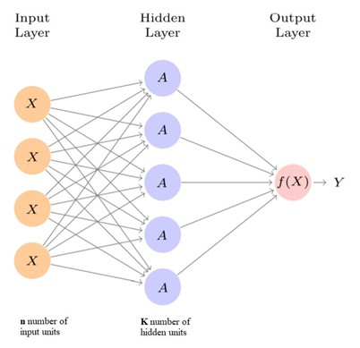
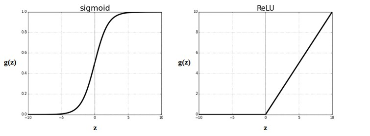
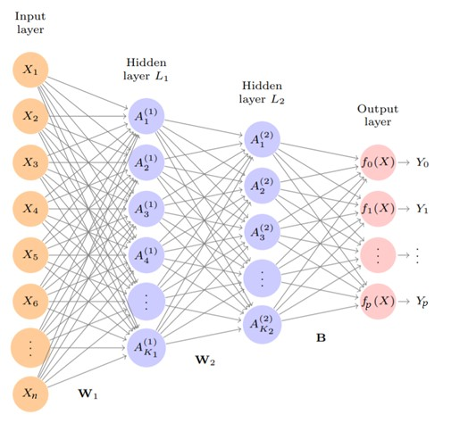
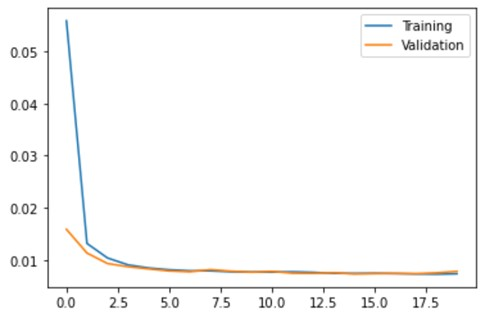

```{r setup, include=FALSE}
knitr::opts_chunk$set(echo = TRUE)
```

### 1. DEFINITION AND PURPOSE OF THE STUDY

The goal of this study is to achieve fundamental and technical information about deep learning while researching the literature and applying it on code practices. 

### 2. AN OVERVIEW OF DEEP LEARNING

The history of deep learning goes back to McCulloch & Pitts paper published in 1943. According to the study, what makes a human brain a computational device is the neural activity in the mind. Taking this into consideration, deep learning algorithms have been influenced by human brains, which can understand complicated information.

If a network has enough number of neurons and has a proper synaptic connection, then it can compute any value. In this case, a simple logic function will be applied depending on the weights in the McCulloch & Pitts neuron. Furthermore, the concept of threshold is an important feature. For a precise neuron, if the net input which is weighted sum of the inputs are greater than the certain threshold then the neuron will be fired. 

In 1949, Hebb published a book called “The Organization of Behavior”. Hebb suggested that the brain's connectivity is constantly changing as an organism while learning different functional tasks. The idea behind Hebb's theory is that if two neurons are found to be active at the same time, fired together, the strength of the connection between them should be increased. The strength of the connection between neurons will be changed while learning.

Tasks such as learning to classify labeled examples and recognition of distinct patterns were performed by the term called perceptron. Perceptron is the method for iterative weight arrangement, therefore the weights on the connection paths can be improved. Rosenblatt proved a theorem that the learning algorithm can find the right answer if there was a sufficient set of parameters for classifying and there were adequate number of examples. However, in the 1950s the perceptron learning algorithm was needed digital computers to compute with real numbers which was carried out insufficiently in that time. 

Deep learning networks allows communication between computers and human beings while being a bridge between digital and the daily life. In other words, it provides a balance between real word which is complex and indefinite with a word with symbols and rules.  

### 3. NEURAL NETWORKS  
In this section, we closely followed the book titled “An Introduction to Statistical Learning with Application in R” by Gareth James, Daniela Witten, Trevor Hastie, Robert Tibshirani.  

#### 3.1. Single Layer Neural Networks  
For predicting the response Y, a neural network will build nonlinear function $\small \vec{X} \to Y$ where $\small X$ is input vector of $\small n$ number of variables $\small \vec{X} =(X_1,X_2,...,Xn)$. These input units will affect the model’s result.  

<center></center>  

_Figure 1_ shows feed-forward neural network with single layer. The input vector $\small \vec{X}$ will create input layer neurons in the neural network. Each unit from the input layer will feed the hidden layer network which has K hidden units. In this layer, the units are neither inputs nor outputs, that is why it is called hidden.  
$$f(X)=β_0+\sum_{k=1}^Kβ_k h_k (X) $$  
$$=β_0+\sum_{k=1}^Kβ_k g(w_0k+\sum_{i=1}^nw_{ik} X_i).$$
In Equations above, $\small w_{11},…,w_{nK}$ indicate weights flow through input layer to hidden layer. Similarly,$\small β_1,β_2,…,β_K$ indicate weights flow through hidden layer to output. $\small β_0$ and $\small w_{0k}$ are the bias terms. First index of $\small w$ shows that which neuron in the input layer will feed into the hidden layer. Second index of $\small w$ shows which neuron in the hidden layer feeded up.

$\smallβ$  and $\small w$ parameters must be estimated from data. 

##### 3.1.1. Activation Function 

Nonlinearity is included to a neuron through activation function that is crucial for finding a solution of complex neural network problems. If nonlinearity in the activation function is not applied, network model turns into a simple linear regression model. Also, the nonlinearity of the activation function provides better reflection of complex data.

$\small A_k$ are the neurons in the hidden layer.$\small h_k (X) $is the function that builds $\small A_k$ with input features. $\small g(t)$ is an activation function that is nonlinear in advance:  
$$A_k= h_k(X)=g(w_{0k}+\sum_{i=1}^nw_{ik} X_i).$$
$\small f(X)$  function will be computed with weights $\small β_k$ and the activations $\small A_k$ from hidden layer pass into the output layer: 

$$f(X)= β_0+\sum_{k=1}^Kβ_k A_{k}. $$  

##### 3.1.1.1. Sigmoid Activation Function

Sigmoid activation function was used as a default activation function for neural network until the early 1990s. It scales input values between 0 and 1,  
$$g(t)=  \frac{e^t}{(1+ e^t )}=  \frac{1}{(1+ e^{-t})}.$$  
Only changes around the mid-point are sensitive to the functions as seen in _Figure 2_.  

##### 3.1.1.2. ReLU Activation Function

The rectified linear activation function (ReLU) is a piecewise function that when input value is positive it equals to itself, or else it equals to 0. If the input value is positive ReLU function is linear, or else it is nonlinear. The ReLU function is more sensitive than sigmoid function.  
\begin{equation}
g(t)=(t)_{+}= 
\begin{cases} 
0         & \text{if } t < 0 \\
t         & \text{otherwise } 
\end{cases}
\end{equation}
<center></center>  
Earlier, sigmoid activation function was preferred, but today, ReLU activation function is common in modern neural networks because it is more powerful to compute and store.   

##### 3.1.2. Squared-Error Loss

Squared error function is commonly used to estimate efficiency of the neural network model. It is used to compare the predicted value with the actual value where $\small f(x_i)$ is the prediction and $\small y_i$ is the $\small i^{th}$ observation. The unknown parameters such as biases and weights are determined to minimize

$$\sum_{i=1}^n(y_i-f(x_i ))^2,$$  
while fitting the model.  

#### 3.2. Multilayer Neural Networks

A large size single hidden layer is theoretically sufficient to make an acceptable approximation. Nevertheless, more than one hidden layer with small size returns good results much more easily.  
<center></center>  

Apart from the number of layers, the difference between _Figure 1_ and _Figure 3_ is the number of results. In single layer neural network there were one output, however in this example, in two hidden layer neural network there are p number of outputs. Nevertheless, it is not necessary to have multiple outputs.

Similarly to single layer neural network, the activation function applied from input layer to first hidden layer:

$$A_k^{(1)}  = h_k^{(1)}(X) = g(w_{0k}^{(1)}+\sum_{i=1}^nw_{ik}^{(1)} X_i), $$  
for $\small k=1,2,…,K_1.$  

First hidden layer activations $\small A_k^{(1)} $ will be treated as inputs for the second hidden layer activations:   
$$A_l^{(2)}  = h_l^{(2)}(X) = g(w_{0l}^{(2)}+\sum_{k=1}^{K_1}w_{kl}^{(2)} A_k^{(1)})$$  
for $\small l=1,2,…,K_2.$  

Each of the activation functions, are function of $\small \vec{X}$ input vector. After sequences of transformations, the network will generate complex $\small \vec{X}$ transformations which are fed as features into the output layer.  

At the output layer there are p number of results. The function is 
$$f_m (X)=β_{0m}+\sum_{l=1}^{K_2}β_{lm}h_l^{(2)}(X)=β_{0m}+\sum_{l=1}^{K_2}β_{lm}A_l^{(2)},$$
while $\small m=1,2,…,p$ if all these results are different.  

### 4. CODE PRACTICES  

#### 4.1. The Libraries Used
 
The Python libraries showed in the _Table 1_, are essential to be able to use particular functions.  

<style>
table {
  text-align:center;
  font-family: arial, sans-serif;
  border: 1px solid black;
  border-collapse: collapse;
  width: 100%;
}

td{
  text-align:left;
  border: 1px solid black;
  padding: 8px;
}
th {
  text-align:center;
  border: 1px solid black;
  padding: 8px;
}
tr:nth-child(even) {
  background-color: #dddddd;
}
</style>
<table class="center" >
  <tr>
    <th>Libraries      </th>
    <th>Description</th>
  </tr>
  <tr>
    <td>NumPy</td>
    <td>NumPy is the essential package for scientific computing such as linear algebra.</td>
  </tr>
  <tr>
    <td>pandas</td>
    <td>Pandas is an open-source data analysis and manipulation tool built on the Python programming language.</td>
  </tr>
  <tr>
    <td>tensorflow</td>
    <td>TensorFlow is an open-source library which is used mainly for deep learning applications.</td>
  </tr>
  <tr>
    <td>sklearn</td>
    <td>Sklearn library is essential for machine learning applications and statistical modeling in term of tools for classification and regression.</td>
  </tr>
  <tr>
    <td>keras</td>
    <td>Keras which runs on top of the TensorFlow is used for evaluating deep learning models such as artificial neural networks.</td>
  </tr>
  <tr>
    <td>matplotlib</td>
    <td>Matplotlib is useful library for data visualization and graphical plotting.</td>
  </tr>
</table>
<center><p> _Table 1: Python libraries used._ </p></center> 

```{r, eval=F, echo=T}
import numpy as np
import matplotlib.pyplot as plt  import pandas as pd
from pandas import Series from tensorflow.keras.models import Sequential from tensorflow.keras.layers import Dense
from sklearn.model_selection import train_test_split from keras.callbacks import EarlyStopping
from sklearn.preprocessing import MinMaxScaler
```

#### 4.2. The Dataset

The dataset is taken from [Kaggle](https://www.kaggle.com/gunhee/koreahousedata).

```{r, eval=F, echo=T}
daegu_df = pd.read_csv("Daegu_Real_Estate_data.csv")
```
  
The data called Daegu_Real_Estate_data is in CSV format. The dataset contains house sale prices in the city of Daegu, Republic of Korea. 

The dataset has 5891 rows and 30 columns. This dataset is chosen because it is suitable for the regression problem and has large number of entries without NA values. Moreover, due to the large number of columns, the result depended on many different variables. 

Several variables are considered as less relevant to the house sale prices. For this reason, some columns are dropped. 

After dropping,  there are only 19 columns are remained as shown in _Table 2_. For the regression problem, the target variable is chosen as “SalePrice”.

<style>
table {
  text-align:center;
  font-family: arial, sans-serif;
  border: 1px solid black;
  border-collapse: collapse;
  width: 100%;
}

td{
  text-align:left;
  border: 1px solid black;
  padding: 8px;
}
th {
  text-align:center;
  border: 1px solid black;
  padding: 8px;
}
tr:nth-child(even) {
  background-color: #dddddd;
}
</style>
<table class="center" >
  <tr>
    <th>Column name     </th>
    <th>Description</th>
    <th>Type</th>
  </tr>
  <tr>
    <td>SalePrice</td>
    <td>Price in US dollar</td>
    <td>Numeric</td>
  </tr>
  <tr>
    <td>YearBuilt</td>
    <td>Year that apartment is built.</td>
    <td>Numeric</td>
  </tr>
  <tr>
    <td>Size(sqf)</td>
    <td>Size of apartment in square feet.</td>
    <td>Numeric</td>
  </tr>
  <tr>
    <td>Floor</td>
    <td>What floor is property located</td>
    <td>Numeric</td>
  </tr>
  <tr>
    <td>HallwayType</td>
    <td>Type of the hallway</td>
    <td>Categoric</td>
  </tr>
  <tr>
    <td>HeatingType</td>
    <td>Type of the heating</td>
    <td>Categoric</td>
  </tr>
  <tr>
    <td>N_elevators</td>
    <td>Total number of elevators in an apartment complex</td>
    <td>Numeric</td>
  </tr>
  <tr>
    <td>SubwayStation</td>
    <td>Name of subway station nearby apartment</td>
    <td>Categoric</td>
  </tr>
  <tr>
    <td>N_FacilitiesNearBy(PublicOffice)</td>
    <td>Number of public offices nearby apartment</td>
    <td>Numeric</td>
  </tr>
  <tr>
    <td>N_FacilitiesNearBy(Hospital)</td>
    <td>Number of hospitals nearby apartment</td>
    <td>Numeric</td>
  </tr>
  <tr>
    <td>N_FacilitiesNearBy(Dpartmentstore)</td>
    <td>Number of department stores nearby apartment</td>
    <td>Numeric</td>
  </tr>
  <tr>
    <td>N_FacilitiesNearBy(Mall)</td>
    <td>Number of malls nearby apartment</td>
    <td>Numeric</td>
  </tr>
  <tr>
    <td>N_FacilitiesNearBy(ETC)</td>
    <td>Number of hotels, special schools etc.</td>
    <td>Numeric</td>
  </tr>
  <tr>
    <td>N_FacilitiesNearBy(Park)</td>
    <td>Number of parks nearby apartment</td>
    <td>Numeric</td>
  </tr>
  <tr>
    <td>N_SchoolNearBy(Elementary)</td>
    <td>Number of elementary schools nearby apartment</td>
    <td>Numeric</td>
  </tr>
  <tr>
    <td>N_SchoolNearBy(Middle)</td>
    <td>Number of middle schools nearby apartment</td>
    <td>Numeric</td>
  </tr>
  <tr>
    <td>N_SchoolNearBy(High)</td>
    <td>Number of high schools nearby apartment</td>
    <td>Numeric</td>
  </tr>
   <tr>
    <td>N_SchoolNearBy(University)</td>
    <td>Number of universities nearby apartment</td>
    <td>Numeric</td>
  </tr>
   <tr>
    <td>N_FacilitiesInApt</td>
    <td>Number of facilities for residents like swimming pool, gym, playground</td>
    <td>Numeric</td>
  </tr>
</table>
<center><p> _Table 2: Columns of the dataset after tidying with data types._ </p></center>  

#### 4.3. Data Manipulation  
```{r, eval=F, echo=T}
daegu_df = pd.get_dummies(daegu_df, drop_first=True)
```

There are 3 categorical variables as seen as _Table 2_. Since the data type is categorical, to use these variables in the model, it is necessary to convert them into numerical values. The term one hot encoding means that categorical variables are represented as binary form such as 0s and 1s. Therefore, with using get_dummies function from pandas library, these variables turn into one hot encoding form. After this process the number of columns increases to 26. Furthermore, argument "drop_first" of get_dummies is used to reduce the correlations created among dummy variables with dropping out the extra column. 

```{r, eval=F, echo=T}
features = daegu_df.iloc[:, 1:30]
prices = daegu_df.iloc[:, 0]
```

The dataset is divided into features and prices for training.  

```{r, eval=F, echo=T}
features = MinMaxScaler().fit_transform(features) 
prices=MinMaxScaler().fit_transform(prices.values.reshape(len(prices),1))[:,0]
```

Since the variables has different ranges of values, scaling is needed to get an efficient result. Fit_transform() is a combination of fit and transform method. Fit method computes the mean and standard deviation of the feature and transform method applies these calculations to every data point for each feature. MinMaxScaler() is applied for normalization which is scaling each data point with:
$$t=\frac {x-min}{max-min}.$$
#### 4.4. Deep Learning Experiment
```{r, eval=F, echo=T}
features_train, features_test, prices_train, prices_test = train_test_split(features, prices, test_size = 0.3, random_state = 33)
```

30% of the dataset has been remained for testing and 70% of it will used for training. The random_state argument ensures that the same data is distributed every time when model runs.

```{r, eval=F, echo=T}
model = Sequential()
model.add(Dense(20, input_shape=(25,), activation='relu'))
model.add(Dense(10, activation='relu'))
model.add(Dense(1, activation='linear')
```

There is a function called Sequential() to build models layer by layer in Keras. Each layer is followed by the next layer with its corresponding weights. The add function is used for adding layers to the model. 
Dense class is applied for connecting layers. In the first argument of the Dense class, the number of neurons for each layer is defined. The input_shape argument specifies the number of neurons in the input layer. 
For activation function, ReLU and linear function is used for hidden layers and output, respectively.

```{r, eval=F, echo=T}
model.compile(loss='mean_squared_error', optimizer='sgd')
```

The loss function is needed to be specified for evaluating weights according to it. The optimizer Stochastic Gradient Descent (SGD) is used for computation of the gradient and it will update the weights on small batches. 

```{r, eval=F, echo=T}
es = EarlyStopping(monitor='val_loss', mode='min', verbose=1, patience=5)
```

While training the model, the number of epochs to apply is a crucial issue. If the number of epochs is high, the developed model may be over-fitting for the training dataset, while using less may result in underfitting. This problem can be avoided by applying the early stopping method. On model.fit, argument “epochs” mostly given as large numbers. The early stopping stops training of the model when it realizes the model has already learned.

```{r, eval=F, echo=T}
history = model.fit(features_train, prices_train, epochs=1000, batch_size=30, validation_data=(features_test, prices_test), callbacks=[es])
```

The model has been specified and compiled; therefore, it is now ready for efficient computing.

```{r, eval=F, echo=T}
plt.plot(history.history['loss'], label='Training')
plt.plot(history.history['val_loss'], label='Validation')
plt.legend()
plt.show()
```

Y axis shows loss which is the mean squared error value while x axis showing epochs. _Figure 4_ shows comparison of training data and validation data. It shows decrease in the loss by epochs. 

<center></center>

```{r, eval=F, echo=T}
model.evaluate(features_test,prices_test)
```

model.evaluate shows test data’s loss value for the model that been build. For this practice, the test data’s loss is 0.007.  

```{r, eval=F, echo=T}
model.summary()
```

In model.summary() output, the number of neurons and parameters are shown for each layer. Also, total number of parameters are shown.  

### 5. RESULTS

Feed forward neural network, which is a subject of deep learning was thoroughly learned during this semester. Also, preparation and research have been done for the application to be held in the next semester. While researching, the mathematical relationships and the parameters affecting the result were learned, the related equations were examined. In addition, regression problem sample was studied to reinforce what was learned throughout this period. Deep learning functions and their arguments on Python were examined and practiced on the sample data set.

### 6. FUTURE WORKS

In the next semester, recurrent neural networks will be learned before the application which is the main purpose of this design. Later, with the recurrent neural networks examined, we plan to study on climate dataset which is time series. Therefore, after deciding which dataset we will study on, by examining the dataset, we will develop a model for problem we detected. Afterwards, we will investigate the change over time for our problem and try to predict the future.

### REFERENCES  
* [Computational Neuroscience: Mathematical and Statistical Perspective](https://www.annualreviews.org/doi/10.1146/annurev-statistics-041715-033733)  
* [Introduction to Neural Networks Using Matlab 6.0](https://books.google.com.tr/books?hl=tr&lr=&id=jJTN8RPgyXgC&oi=fnd&pg=PR21&dq=S.N.+Sivanandam,+S.+Sumathi,+S.N.+Deepa,+Introduction+to+Neural+Networks+Using+Matlab+6.0+(McGraw+Hill+Education+(India)+Private+Ltd.,+2006)%0A&ots=h1cxOQLyOJ&sig=OWBFNKIPYtnu2uqKPioDly-9oXA&redir_esc=y#v=onepage&q&f=false)  
* [The unreasonable effectiveness of deep learning in artificial intelligence](https://www.pnas.org/content/117/48/30033Ad)  
* [An Introduction to Statistical Learning with Application in R](https://www.statlearning.com/)  
* [A Gentle Introduction to the Rectified Linear Unit (ReLU)](https://machinelearningmastery.com/rectified-linear-activation-function-for-deep-learning-neural-networks/)
